# Self-Service Guide for Events Portal

Welcome! This guide walks you through running an event from start to finish — checking people in, giving everyone a prize on their phone, running a lucky draw on the big screen, and letting the whole room follow along.

Don't worry if you've never used the portal before, or if none of this is your usual sort of thing. It's all point-and-click, there's nothing here you can break, and this guide starts from the very beginning. Take it one step at a time and you'll be set up in minutes.

**The portal lives here:** <https://pp-events-alfc5lzdla-as.a.run.app>

---

## [Contents](#contents)

1. [Events — create one, check people in, see the numbers](#1-events)
2. [Spin & Win — everyone wins a prize on their own phone](#2-spin--win)
3. [Lucky draw — the big-screen draw you run from the front](#3-lucky-draw)
4. [Access — letting a colleague into the portal](#4-access)

---

## [Spin & Win or Lucky Draw?](#spin--win-or-lucky-draw)

The portal has two prize games and they work very differently. Here's the short version:

|  | 🎁 **Spin & Win** | 🎰 **Lucky draw** |
| --- | --- | --- |
| **Who plays** | Everyone, individually | The host, on behalf of the room |
| **Where** | On each person's own phone | One big screen at the front |
| **When** | Any time after they check in | When the host presses Spin |
| **How many win** | Everyone gets a prize | One winner per spin |
| **Set up in** | The event form, with your prize list | Its own Lucky Draw section |

**Spin & Win** is a thank-you gift. Each person scans a QR code, spins a wheel on their phone, and gets a prize. One spin each, everybody wins something.

**Lucky draw** is the moment on stage. The host presses one button, a reel of names spins on the big screen, and it lands on a single winner while the room watches.

You can use one, the other, or both at the same event.

---

## [1. Events](#1-events)

Everything starts with an event. An event holds the guest list — and that guest list is what both prize games draw from.

### [1.1 Create an event](#11-create-an-event)

Sign in to the portal and you'll land on the **Events** page, which lists everything that's been run before.

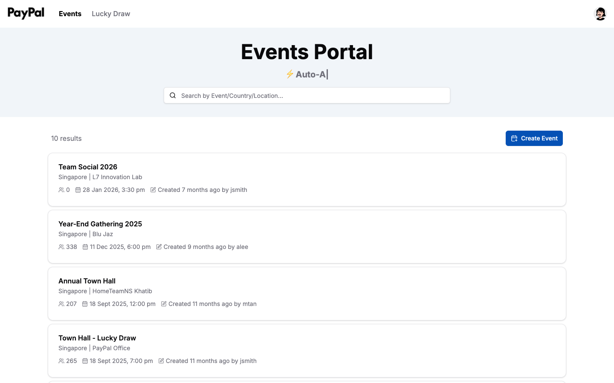

Click **Create Event** in the top right and fill in the form.

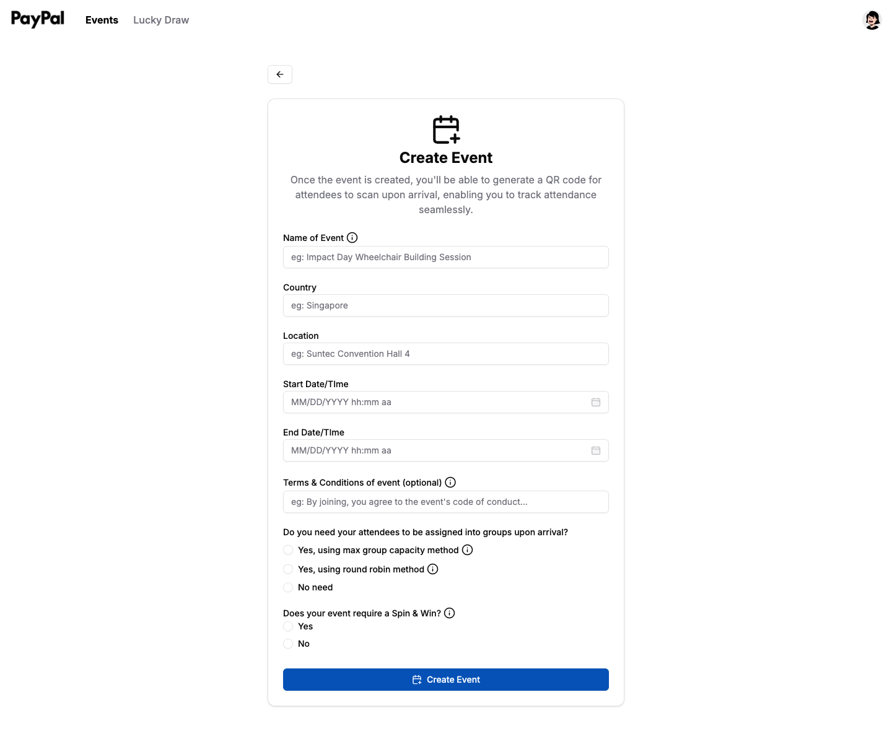

Here's what each field is for:

| Field | What to put |
| --- | --- |
| **Name of Event** | What people see when they check in, e.g. *Annual Town Hall* |
| **Country** and **Location** | Where it's happening |
| **Start** and **End Date/Time** | When it runs |
| **Terms & Conditions** | Optional. Shown to attendees when they check in |

Then two questions worth understanding:

**"Do you need your attendees to be assigned into groups upon arrival?"**

If your event has team activities, the portal can sort people into groups as they arrive — no clipboards required.

- **Max group capacity** — fills one group before starting the next. Set the max to 3 and the first three arrivals go to Group 1, the next three to Group 2.
- **Round robin** — deals people out in a loop: Group 1 → 2 → 3 → back to 1.
- **No need** — everyone is simply checked in.

**"Does your event require a Spin & Win?"**

Choose **Yes** if you'd like every attendee to win a prize on their phone. You'll be asked to list your prizes here — see [Section 2](#2-spin--win) for how that works and what happens next.

Click **Create Event** when you're done.

### [1.2 Check people in](#12-check-people-in)

Open your event and click **Check-in QR code** in the top right.

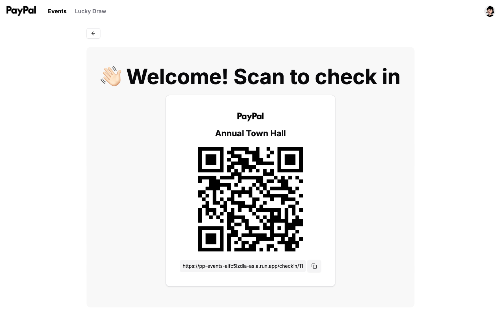

Put this on a screen at the entrance, print it on a poster, or share the link — whatever suits your venue. There's a copy button beside the link if you'd rather send it out.

When someone scans it, they see this:

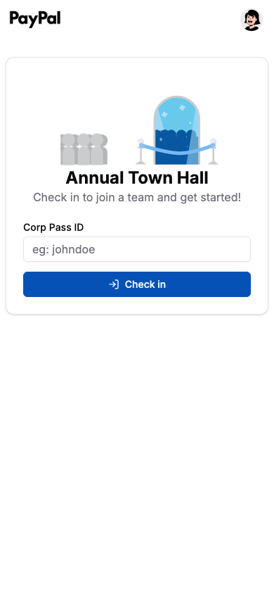

They enter their **Corp Pass ID** — the first part of their email, so `johndoe` for `johndoe@paypal.com` — and tap **Check in**. That's it, they're on the list.

If you turned on grouping, their group number appears straight away.

> **Good to know:** attendees never need an account or a password. Only organisers sign in.

### [1.3 See how it went](#13-see-how-it-went)

Open the event any time — during or after — to see where things stand.

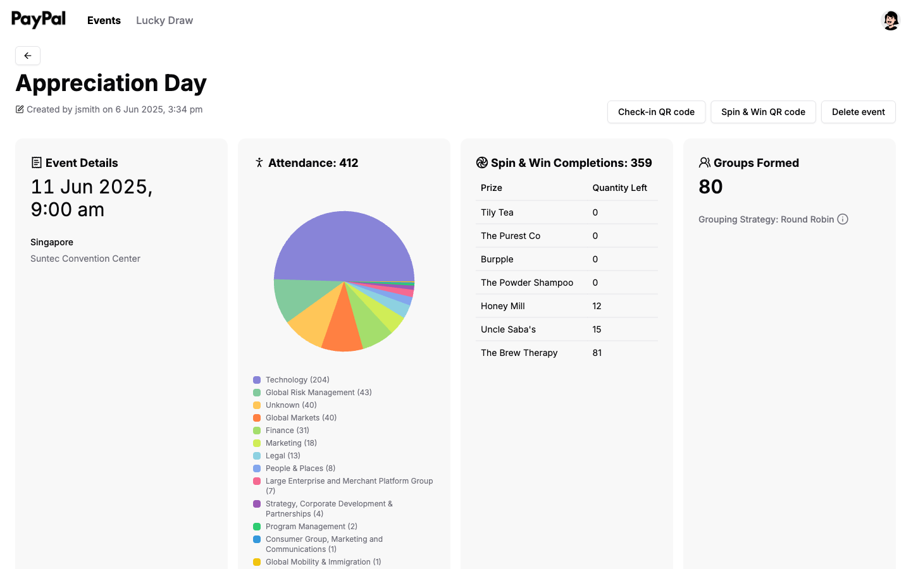

At a glance you get:

- **Attendance** — how many have checked in, updating as they arrive, with a breakdown of which parts of the business turned up
- **Groups Formed** — how many groups exist and which method was used
- **Spin & Win Completions** — how many people have claimed a prize, and how many of each prize are left
- **Overview** — every attendee, when they registered, their group, and what they won

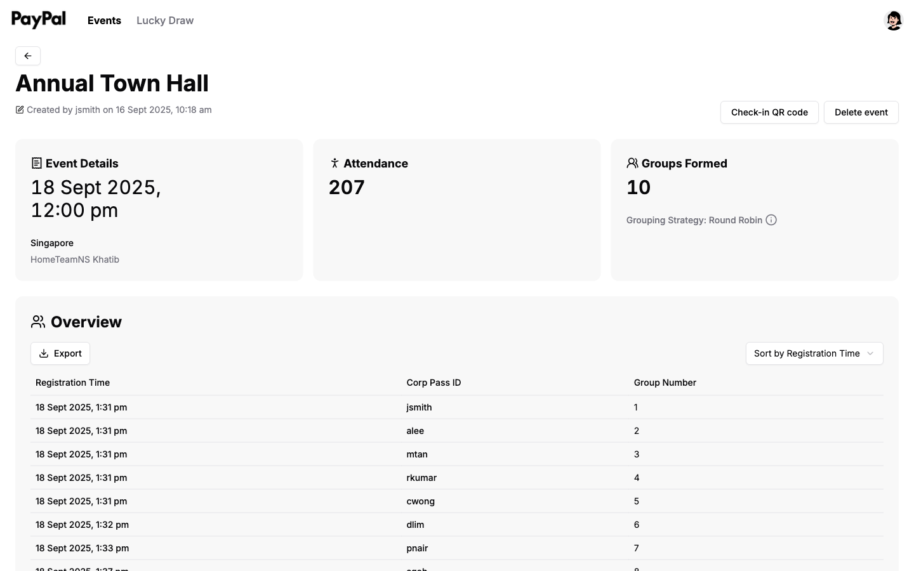

**Export** downloads the whole list as a spreadsheet, which is handy for reporting or following up with people afterwards.

---

## [2. Spin & Win](#2-spin--win)

Spin & Win is the individual game: **everyone gets one spin on their own phone, and everyone wins a prize.** It's the thank-you gift, not the prize draw.

### [2.1 Set up your prizes](#21-set-up-your-prizes)

Spin & Win is switched on when you create the event. Answer **Yes** to *"Does your event require a Spin & Win?"* and a prize list appears.

For each prize, fill in:

| Field | Example |
| --- | --- |
| **Brand of Prize** | Apple |
| **Prize Description** | AirPods |
| **Picture of Prize** | A photo — this is what winners see |
| **Quantity** | 5 |

Add as many prizes as you like. Each one becomes a slice of the wheel, and it stops being handed out once its quantity runs out — so the totals are yours to control.

> **Tip:** make the quantities add up to roughly your expected headcount, so nobody reaches the wheel to find everything gone.

### [2.2 Share the wheel](#22-share-the-wheel)

Open your event and click **Spin & Win QR code**, next to the check-in button.

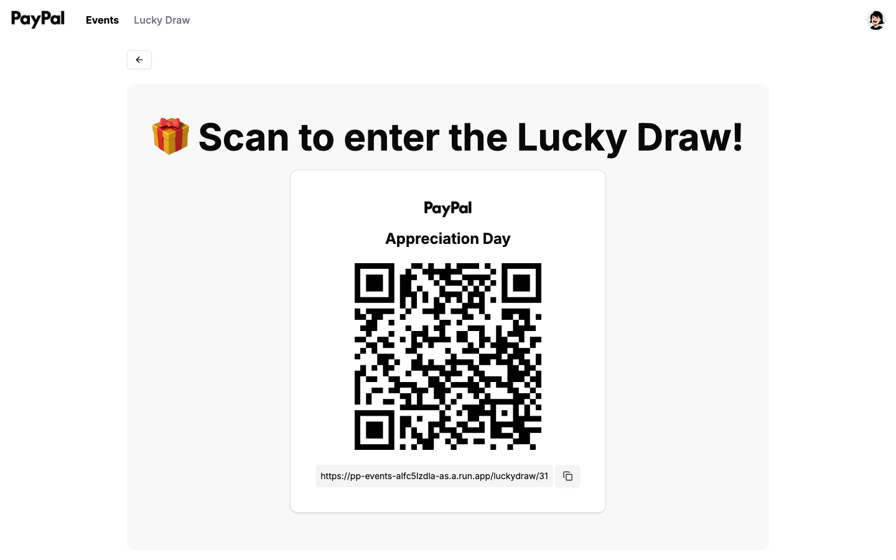

Share this the same way as your check-in code — on a slide, a table card, or as a link. Use the copy button if you'd rather paste it into a chat.

> **Note:** this button only appears if you answered **Yes** to Spin & Win when creating the event.

### [2.3 What people do on their phones](#23-what-people-do-on-their-phones)

When someone scans the code, they're asked for their **Corp Pass ID** — the same one they used to check in.

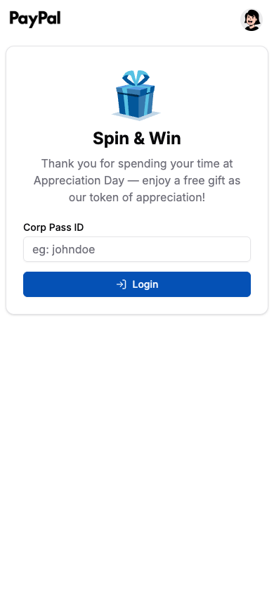

Then they see the wheel, with your prizes as the slices.

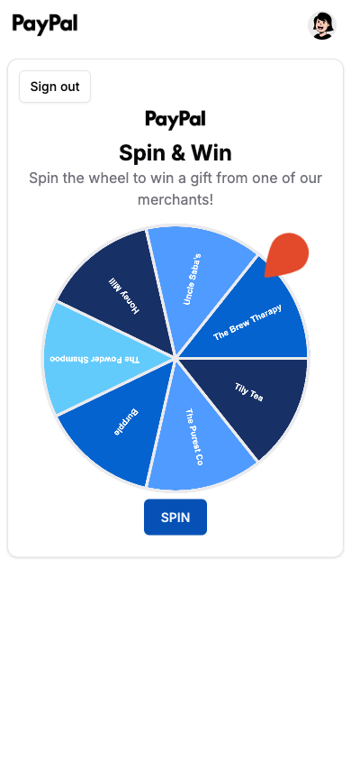

They tap **SPIN**, the wheel turns, and it lands on their prize — shown with its picture so they know exactly what to collect.

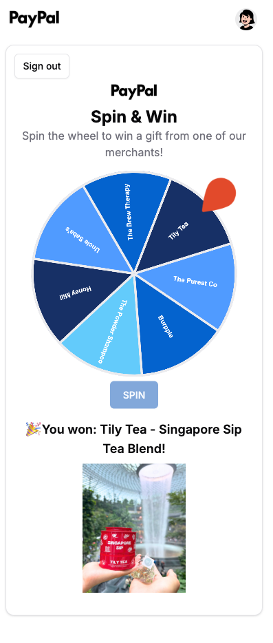

A few things worth knowing:

- **One spin each.** Coming back to the page shows the prize they already won, not another spin.
- **They must be checked in first.** Anyone not on the attendance list is turned away.
- **Everybody wins.** There are no empty slices — the only limit is your quantities.
- **You can watch it live.** The **Spin & Win Completions** panel on the event page counts up as people play.

---

## [3. Lucky draw](#3-lucky-draw)

A lucky draw is the big-screen moment: **the host presses Spin, and one winner is picked from everyone who showed up.** Unlike Spin & Win, nobody plays this on their own phone — they just watch.

> **Before you start:** you need an event with attendees, because that's where participants come from. If you haven't set one up yet, see [Section 1](#1-events) first.

### [3.1 Create the draw](#31-create-the-draw)

Click **Lucky Draw** in the top navigation, then **Create Lucky Draw**.

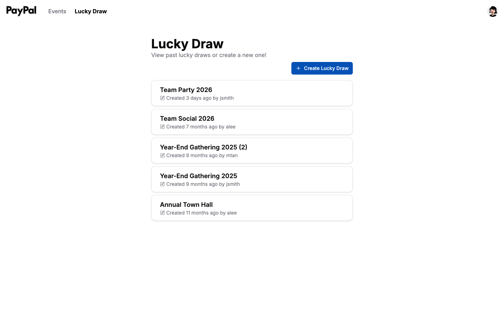

Give it a name and choose which event's attendees take part.

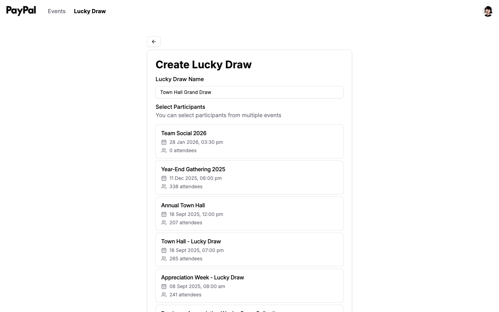

Each event shows its attendee count, so you can see how many people you're drawing from. **You can tick more than one event** — handy if your day had several sessions and you want everyone in the same draw.

### [3.2 Run the draw](#32-run-the-draw)

Open your draw and put this screen on the projector.

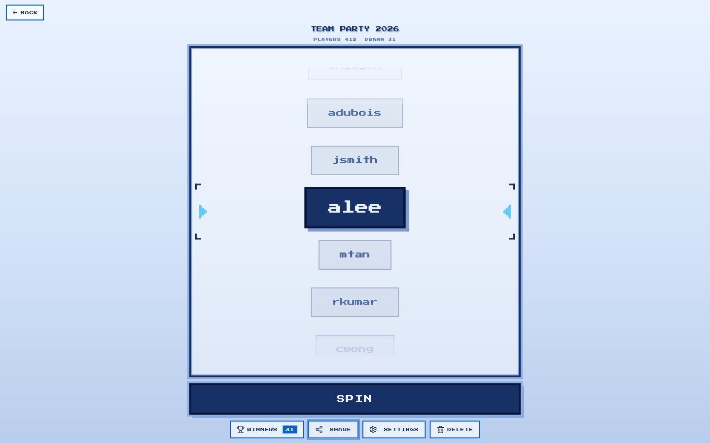

Press **SPIN**. The reel runs for about thirteen seconds, slows, and lands on a winner — announced with sound and fireworks.

- **Nobody wins twice.** Past winners are excluded from later spins automatically.
- **Winners are saved.** Click **WINNERS** to see everyone so far.
- **Spin as often as you like** — usually once per prize.
- **Presentation clickers work**, so you can run it from the front of the room.

**SETTINGS** lets you adjust speed, colours, sound and fireworks beforehand.

### [3.3 No big screen? Share a view-only link](#33-no-big-screen-share-a-view-only-link)

If there's no projector — or the screen is too small for the room — everyone can watch on their own phone instead.

On the draw screen, click **SHARE**.

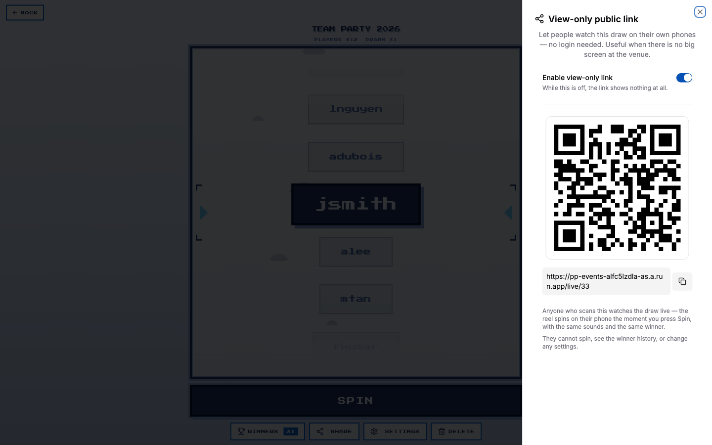

Turn on **Enable view-only link**, then share the QR code or link however you like.

> **Important:** the link shows nothing at all until this toggle is on. If people say the page isn't working, check the toggle first.

### [3.4 What the audience sees](#34-what-the-audience-sees)

They get a welcome screen showing how many people are in the draw.

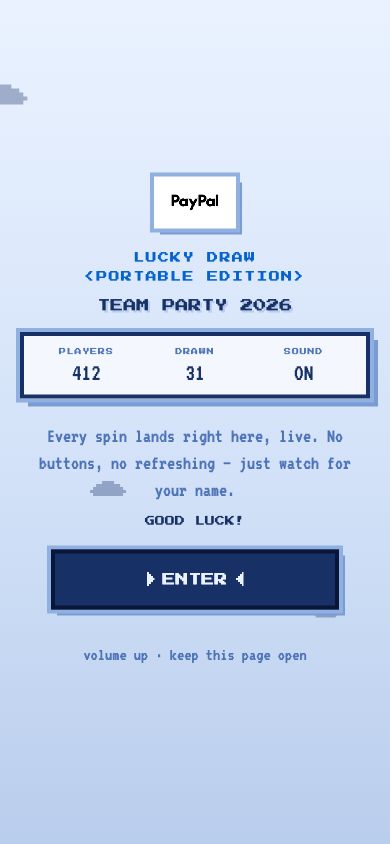

They tap **ENTER** once — that's what lets their phone play sound — and then they're watching.

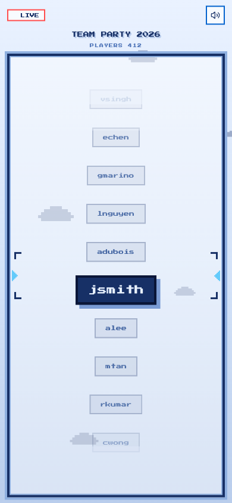

From there it's hands-off:

- **Everyone sees the same reel in the same position**, whether they joined an hour ago or thirty seconds ago.
- **The moment you press Spin, every phone spins** — same names, same timing, same winner.
- **No buttons, no refreshing.** They just watch for their name.
- **There's a mute button** for anyone who'd rather watch in silence.

Watchers can't spin, can't see the winner history, and can't change anything.

> **Tip:** ask people to turn their volume up and keep the page open. If a phone locks, reopening the link puts them straight back in step with the room.

---

## [4. Access](#4-access)

The portal is invite-only, so anyone who needs to organise events has to be added first.

### [4.1 Add someone](#41-add-someone)

Click your **profile picture in the top right**, then **Admin Access**.

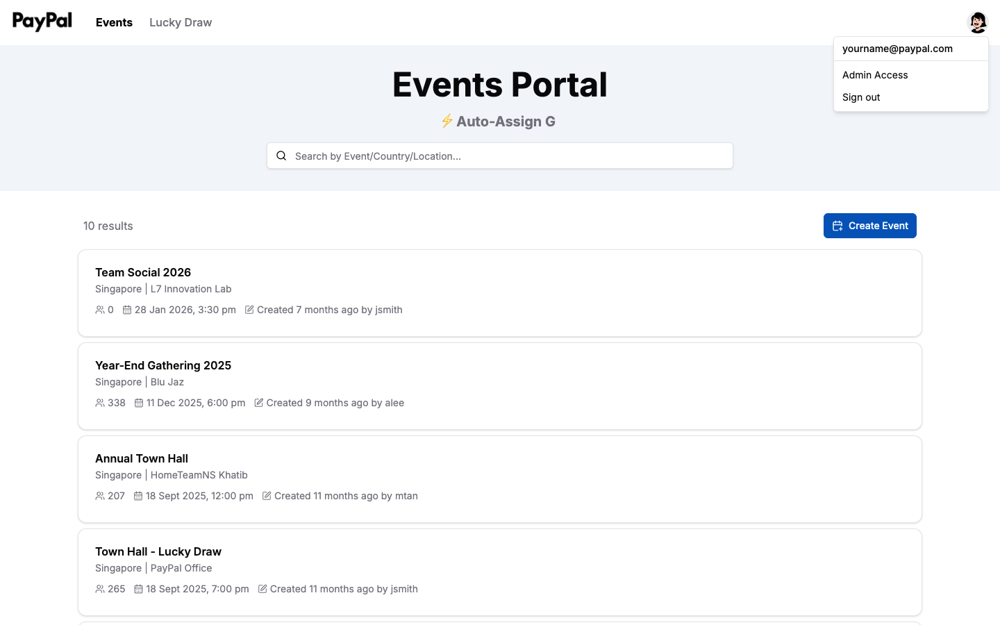

Type their email into the **Add new admin** box and click **Add**.

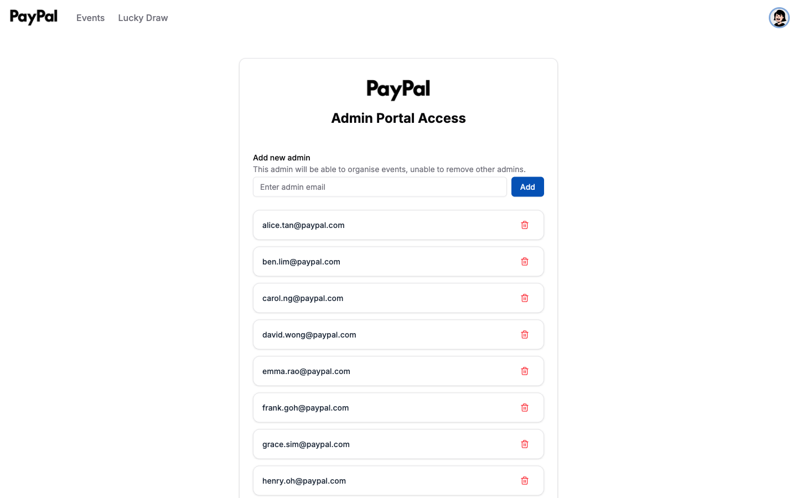

That's all you need to do. Once their email is on the list, they can go to the portal and create their own account with a password of their choosing.

### [4.2 What they can do](#42-what-they-can-do)

Anyone you add can create and manage events and run both prize games, just like you.

They **cannot** remove other admins, so there's no risk of someone accidentally locking the team out.

---

## [Quick answers](#quick-answers)

**What's the difference between Spin & Win and the lucky draw?**
Spin & Win is individual — everyone spins on their own phone and everyone wins. The lucky draw is one big-screen draw run by the host, with one winner per spin. See the [comparison above](#spin--win-or-lucky-draw).

**Can I use both at the same event?**
Yes, and many do — Spin & Win as people arrive, the lucky draw later on stage.

**Do attendees need an account?**
No. Only organisers sign in. Everyone else just scans a QR code.

**Where's the Spin & Win QR code?**
On the event page, next to **Check-in QR code**. It only appears if you enabled Spin & Win when creating the event.

**Can someone spin twice?**
No. Returning to the page shows the prize they already won.

**What if a prize runs out?**
It stops being given out and the remaining prizes are used instead.

**Can I run a lucky draw without an event?**
No — participants come from an event's attendance list. See [Section 1](#1-events).

**Can one draw cover several events?**
Yes. Tick as many as you like when creating it.

**Someone says the view-only link isn't working.**
Check that **Enable view-only link** is switched on in the Share panel.

**Can I get the attendance list as a spreadsheet?**
Yes — open the event and click **Export**.

**Someone joined the live page late. Will they be out of sync?**
No. Late joiners land exactly where everyone else is.

---

*Have a question this guide doesn't answer? Speak to whoever gave you access to the portal.*
